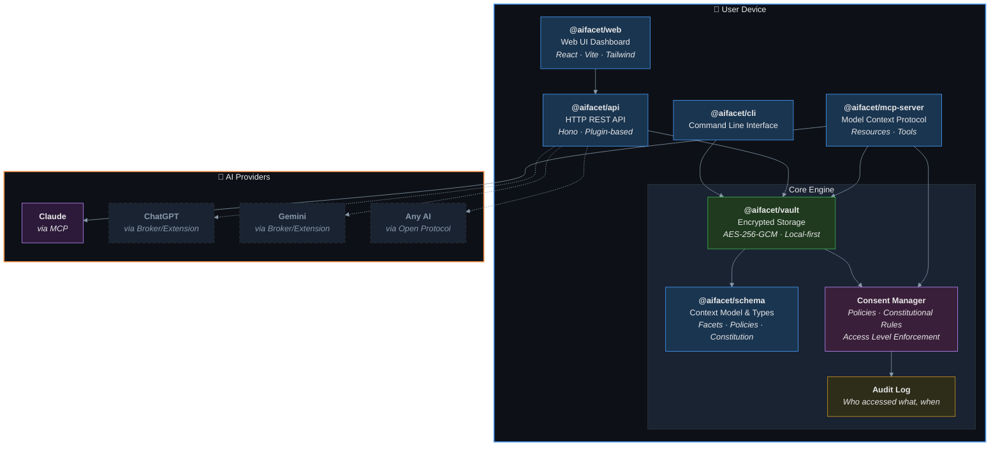
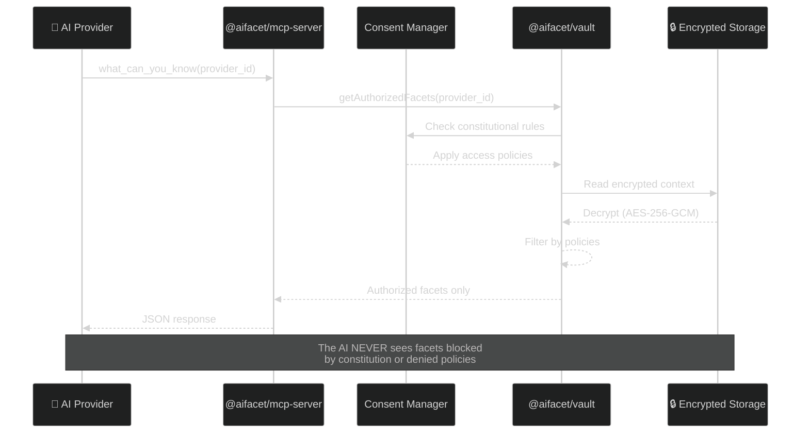
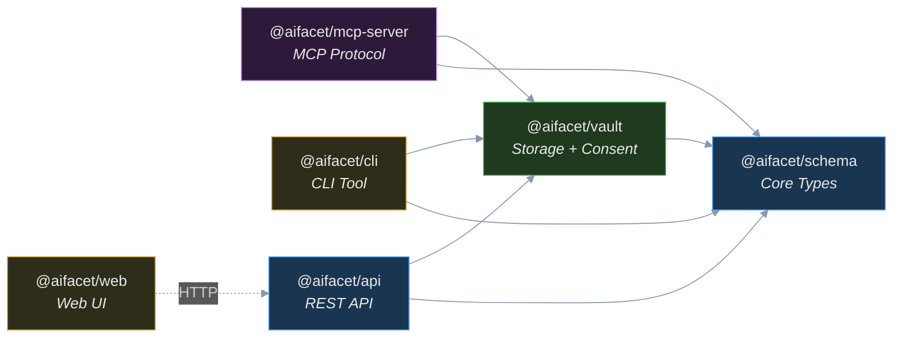
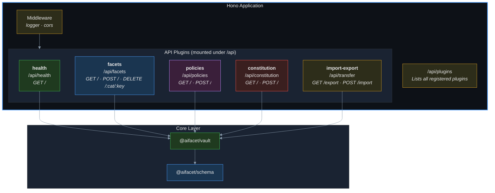
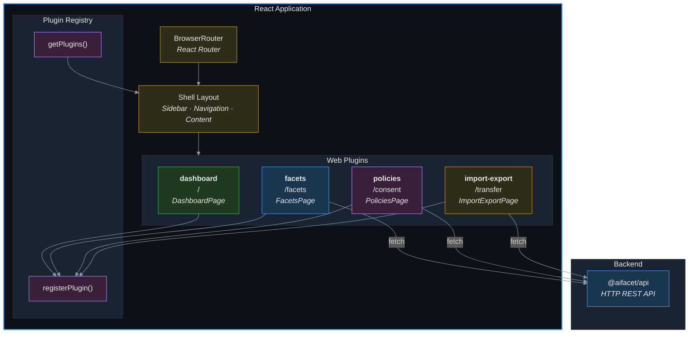
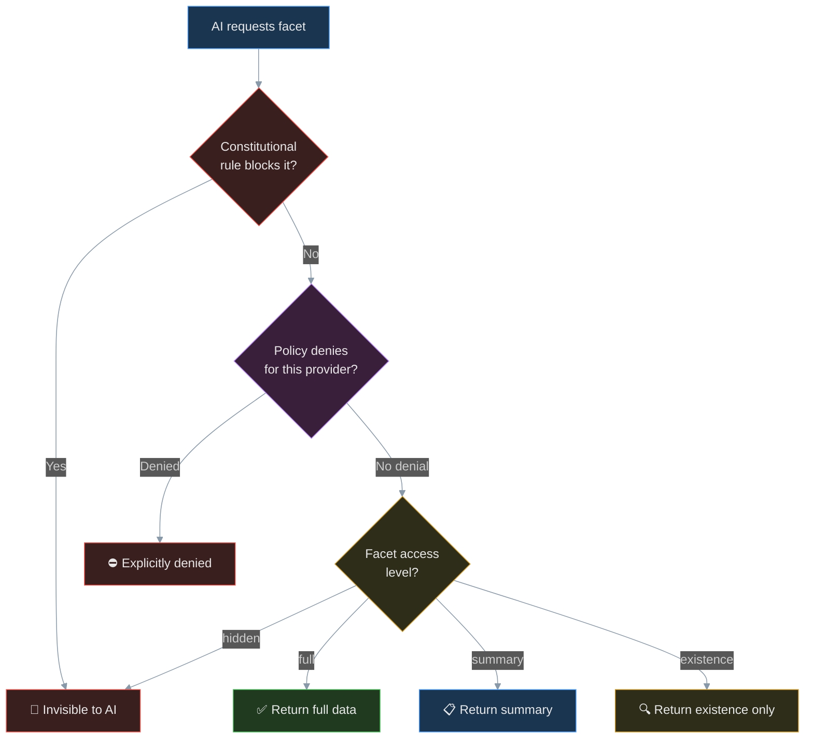

# AIFacet — Architecture Overview

> This document provides a visual guide to the system architecture using Mermaid diagrams.
> Diagrams are designed for dark mode compatibility (GitHub, Safari, VS Code).

## System Architecture



**Legend:**
- Solid borders = implemented now
- Dashed borders = planned for future phases

---

## Data Flow: How Context Reaches an AI



---

## Package Dependency Graph



---

## API Plugin System

The `@aifacet/api` package uses a plugin architecture built on [Hono](https://hono.dev). Each plugin is a self-contained module that registers routes on a base path. The main application composes all plugins under `/api`.



**How API plugins work:**

1. A factory function (e.g., `createFacetsPlugin(vault)`) creates a Hono sub-app with routes.
2. The factory returns an `ApiPlugin` object: `{ id, name, basePath, routes }`.
3. The main app iterates all plugins and calls `api.route(plugin.basePath, plugin.routes)`.
4. All plugins are discoverable via `GET /api/plugins`.

---

## Web Plugin System

The `@aifacet/web` package uses a plugin architecture built on React Router and a central registry. Each plugin registers navigation items and routes via side-effect imports.



**How Web plugins work:**

1. Each plugin is a directory under `packages/web/src/plugins/{name}/` with an `index.tsx` entry point.
2. The entry point calls `registerPlugin()` with the plugin's id, label, icon, nav items, and routes.
3. Registration happens via side-effect imports in `app.tsx` — import order determines nav order.
4. The `Shell` component reads `getPlugins()` to build the sidebar navigation.
5. The `App` component renders all plugin routes inside a shared `<Routes>` tree.

---

## Consent Model: How Access Control Works



---

## Monorepo Structure

```
aifacet/
├── package.json              Root workspace config
├── pnpm-workspace.yaml       Workspace definition
├── docker-compose.yml        Docker stack (API + Web)
├── tsconfig.base.json        Shared TypeScript config (strict)
├── biome.json                Linting & formatting (Biome v2)
├── vitest.workspace.ts       Test workspace config
├── .husky/pre-commit         Pre-commit: lint check
│
├── docs/
│   ├── ARCHITECTURE.md       Architecture overview (this file)
│   ├── GETTING_STARTED.md    Getting started guide
│   ├── TESTING.md            Testing & validation guide
│   └── PLUGIN_GUIDE.md       Plugin development guide
│
├── scripts/
│   └── sandbox.sh            Quick validation script
│
└── packages/
    ├── schema/               @aifacet/schema — Core types
    │   ├── src/types/
    │   │   ├── access.ts     AccessLevel, ConsentPolicy, ConstitutionalRule
    │   │   ├── facet.ts      Facet, FacetMeta, categories
    │   │   └── context.ts    HumanContext, createEmptyContext
    │   └── tests/
    │
    ├── vault/                @aifacet/vault — Encrypted storage
    │   ├── src/
    │   │   ├── storage.ts    AES-256-GCM encrypted file I/O
    │   │   └── vault.ts      Vault API (CRUD, consent enforcement)
    │   └── tests/
    │
    ├── mcp-server/           @aifacet/mcp-server — MCP protocol integration
    │   ├── src/
    │   │   ├── server.ts     MCP resources + tools (about_me, what_can_you_know)
    │   │   ├── http.ts       Streamable HTTP transport server
    │   │   ├── logger.ts     Structured logging utility
    │   │   └── index.ts      Stdio transport entry point
    │   └── tests/
    │
    ├── cli/                  @aifacet/cli — Command line tool
    │   └── src/
    │       └── index.ts      status, facets, add commands
    │
    ├── api/                  @aifacet/api — HTTP REST API
    │   ├── Dockerfile
    │   ├── src/
    │   │   ├── index.ts      Hono app, plugin composition, server startup
    │   │   └── plugins/
    │   │       ├── types.ts          ApiPlugin interface
    │   │       ├── health.ts         GET /api/health
    │   │       ├── facets.ts         CRUD /api/facets
    │   │       ├── policies.ts       CRUD /api/policies
    │   │       ├── constitution.ts   CRUD /api/constitution
    │   │       └── import-export.ts  GET /api/transfer/export, POST /api/transfer/import
    │   └── tests/
    │
    └── web/                  @aifacet/web — Web UI
        ├── Dockerfile
        ├── src/
        │   ├── app.tsx       Root component, plugin imports, router
        │   ├── components/
        │   │   └── layout/
        │   │       └── shell.tsx     Shell layout with sidebar navigation
        │   └── plugins/
        │       ├── registry/
        │       │   ├── types.ts      WebPlugin, NavItem interfaces
        │       │   └── index.ts      registerPlugin(), getPlugins()
        │       ├── dashboard/
        │       │   ├── index.tsx          Plugin registration
        │       │   └── pages/
        │       │       └── dashboard-page.tsx
        │       ├── facets/
        │       │   ├── index.tsx
        │       │   └── pages/
        │       │       └── facets-page.tsx
        │       ├── policies/
        │       │   ├── index.tsx
        │       │   └── pages/
        │       │       └── policies-page.tsx
        │       └── import-export/
        │           ├── index.tsx
        │           └── pages/
        │               └── import-export-page.tsx
        └── tests/
```

---

*Document updated: 2026-03-25*
*Project: AIFacet*
