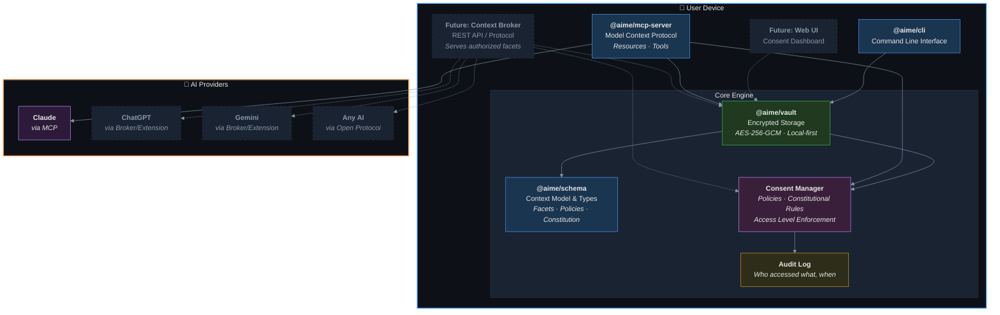
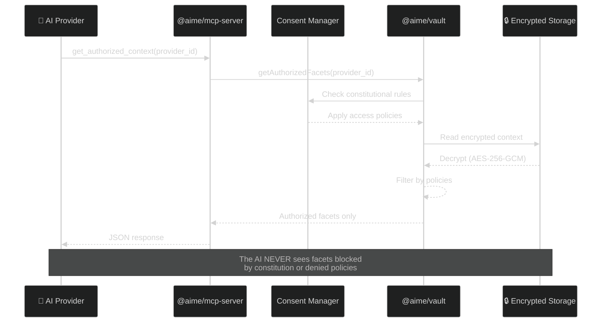
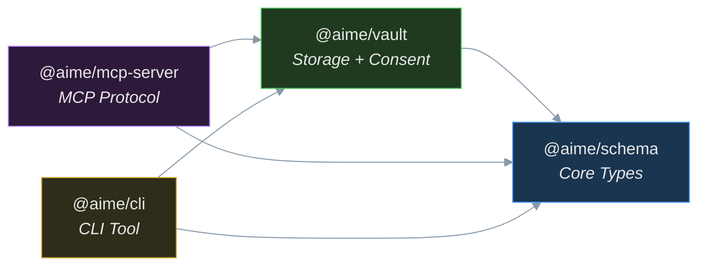
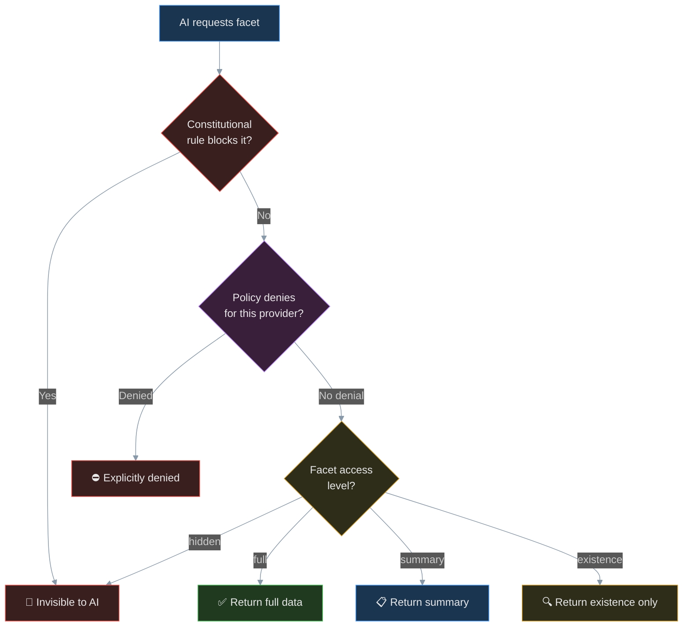

# AIME — Architecture Overview

> This document provides a visual guide to the system architecture using Mermaid diagrams.
> Diagrams are designed for dark mode compatibility (GitHub, Safari, VS Code).

## System Architecture



**Legend:**
- Solid borders = implemented now
- Dashed borders = planned for future phases

---

## Data Flow: How Context Reaches an AI



---

## Package Dependency Graph



---

## Consent Model: How Access Control Works



---

## Monorepo Structure

```
aime/
├── package.json              Root workspace config
├── pnpm-workspace.yaml       Workspace definition
├── tsconfig.base.json        Shared TypeScript config (strict)
├── biome.json                Linting & formatting (Biome v2)
├── vitest.workspace.ts       Test workspace config
├── .husky/pre-commit         Pre-commit: lint check
│
├── docs/
│   ├── design/               Design documents & architecture
│   ├── research/             Market analysis & research
│   └── business/             Monetization & startup roadmap
│
└── packages/
    ├── schema/               @aime/schema — Core types
    │   ├── src/types/
    │   │   ├── access.ts     AccessLevel, ConsentPolicy, ConstitutionalRule
    │   │   ├── facet.ts      Facet, FacetMeta, categories
    │   │   └── context.ts    HumanContext, createEmptyContext
    │   └── tests/            16 tests
    │
    ├── vault/                @aime/vault — Encrypted storage
    │   ├── src/
    │   │   ├── storage.ts    AES-256-GCM encrypted file I/O
    │   │   └── vault.ts      Vault API (CRUD, consent enforcement)
    │   └── tests/            14 tests
    │
    ├── mcp-server/           @aime/mcp-server — Claude integration
    │   ├── src/
    │   │   └── index.ts      MCP resources + tools (get_facets, get_authorized_context)
    │   └── tests/            1 test
    │
    └── cli/                  @aime/cli — Command line tool
        └── src/
            └── index.ts      status, facets, add commands
```

---

*Document generated: 2026-03-25*
*Project: AIME*
